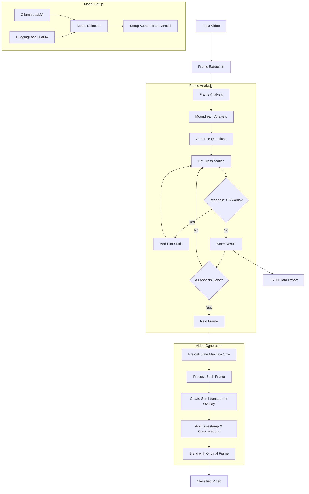

# Video Classification with Moondream

> **⚠️ IMPORTANT:** This project uses Moondream 2B (2025-01-09 release) via the Hugging Face Transformers library.

> **💡 NOTE:** This project offers two options for the LLaMA model:
> 1. Local Ollama LLaMA (Recommended)
> 2. HuggingFace LLaMA (Requires approval)
>
> **⚠️ AUTHENTICATION:** When using HuggingFace authentication, make sure to use a token with "WRITE" permission, not "FINEGRAINED" permission.

## Overview

A Python script that automatically classifies aspects of video frames using Moondream for visual analysis and LLaMA for question formulation. The script processes videos frame by frame and overlays classification results directly onto the video.

## Process Flow Diagram



```
Input Video
    │
    ▼
┌─────────────────┐
│  Model Setup    │
├─────────────────┤
│ ┌─────────────┐ │
│ │Ollama LLaMA │ │
│ │     or      │ │    ┌─────────────┐
│ │HuggingFace  │ │───▶│Auto Install/│
│ └─────────────┘ │    │   Setup     │
└────────┬────────┘    └─────────────┘
         │
         ▼
┌─────────────────┐
│Frame Extraction │
└────────┬────────┘
         │
         ▼
┌─────────────────┐
│ Frame Analysis  │◄─────────────┐
├─────────────────┤              │
│1. Moondream     │              │
│2. Process Each  │              │
│   Aspect:       │              │
│   a. Query      │              │
│   b. Check Len  │     Add Hint Suffix:
│   c. Retry?     │     - "Use fewer words"
└────────┬────────┘     - "Keep it short"
         │              - "Be concise"
         ▼              - "Short response only"
    Word Count ≤ 6? ────────────┘
         │
         ▼
┌─────────────────┐
│Video Generation │
├─────────────────┤
│1. Pre-calc Size │     ┌──────────────┐
│2. Process Frames│────▶│  JSON Data   │
│3. Add Overlay   │     └──────────────┘
│4. Add Text      │
│5. Blend (0.7/0.3│
└────────┬────────┘
         │
         ▼
┌─────────────────┐
│ Final Output    │
└─────────────────┘
```

## Detailed Process Flow

1. **Model Selection & Setup**
   - Choose between local Ollama LLaMA (recommended) or HuggingFace LLaMA
   - For Ollama: Automatic installation and setup if not present
   - For HuggingFace: Requires authentication and model access approval

2. **Video Input**
   - Place video files in the `inputs` folder
   - Supports .mp4, .avi, .mov, and .mkv formats
   - Configure frame extraction interval or total frames to analyze

3. **Aspect Selection**
   - Use default aspects or specify custom ones
   - Default aspects include:
     - Weather conditions
     - Mood
     - Camera angle
     - Clothing color and type
     - Subject gender and hair color
     - Main activity
     - Pose
     - Background
     - Expression

4. **Frame Processing**
   - Extracts frames at specified intervals
   - Each frame is analyzed by Moondream model
   - Responses are limited to 6 words maximum for clarity
   - Multiple attempts to get concise answers if needed

5. **Video Generation**
   - Creates overlay with classification results
   - Consistent caption box sized for longest response
   - Semi-transparent black overlay for readability
   - Timestamp and all classifications shown
   - Exports annotated video to `outputs` folder

6. **Data Export**
   - Saves complete classification data in JSON format
   - Includes timestamps and all classification results

## Prerequisites

- Python 3.8 or later
- CUDA-capable GPU (recommended)
- FFmpeg installed
- For LLaMA model access:
  - Either:
    1. Ollama installed locally (recommended)
    2. HuggingFace account with approved access to Meta's LLaMA model

## Installation

### System Dependencies
```bash
# Linux/Ubuntu
sudo apt-get update
sudo apt-get install ffmpeg libvips libvips-dev

# macOS with Homebrew
brew install ffmpeg vips

# Windows
# 1. Download and install FFmpeg from https://ffmpeg.org/download.html
# 2. Download and install libvips from https://github.com/libvips/build-win64/releases
```

### Python Dependencies
```bash
pip install -r requirements.txt
```

### Model Setup

#### Option 1: Local Ollama (Recommended)
```bash
# The script will automatically:
# 1. Install Ollama if not present
# 2. Start the Ollama service
# 3. Pull the LLaMA model
```

#### Option 2: HuggingFace
1. Visit [meta-llama/Llama-3.2-1B-Instruct](https://huggingface.co/meta-llama/Llama-3.2-1B-Instruct)
2. Request access and wait for approval
3. Authenticate using one of these methods:
   ```bash
   # Method 1: CLI login
   huggingface-cli login

   # Method 2: Use token
   python classify-video.py --token "your_token"
   ```

## Usage

```bash
python classify-video.py [options]

Options:
  --token TEXT            HuggingFace token (if using HF model)
  --frame-interval FLOAT  Extract one frame every N seconds (default: 1.0)
  --total-frames INT      Total number of frames to extract
  --aspects TEXT         Comma-separated aspects to classify
```

## Output

### Classified Video
- Saved in `outputs` folder as `classified_[original_name].mp4`
- Original video with overlaid classifications
- Professional text rendering with dynamic sizing
- Timestamp display

### Classification Data
- JSON file with complete results
- Frame timestamps
- All classifications per frame
- Saved as `data_[original_name].json`

## Troubleshooting

- **CUDA/GPU Issues**:
  - Ensure CUDA toolkit is installed
  - Check GPU memory usage
  - Try reducing frame extraction rate

- **Model Loading**:
  - For Ollama: Check if service is running (`http://localhost:11434`)
  - For HuggingFace: Verify model access and authentication

- **Video Processing**:
  - Ensure FFmpeg is properly installed
  - Check input video format compatibility
  - Verify sufficient disk space for frame extraction

## Performance Notes

- Processing time depends on:
  - Video length and resolution
  - Frame extraction interval
  - GPU capabilities
  - Number of aspects to classify

## Dependencies

- `transformers`: Moondream model and LLaMA pipeline
- `torch`: Deep learning backend
- `opencv-python`: Video processing and overlay
- `Pillow`: Image handling
- `huggingface_hub`: Model access
- `requests`: API communication for Ollama

## License

This project is licensed under the MIT License - see the LICENSE file for details. 